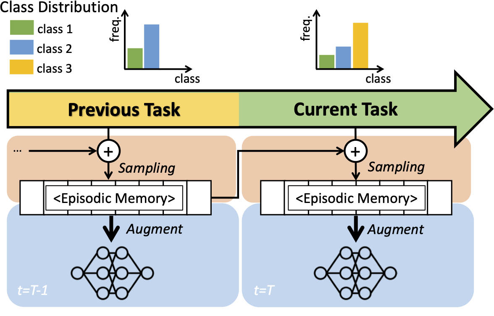

## Rainbow Memory - Official PyTorch Implementation



**Rainbow Memory: Continual Learning with a Memory of Diverse Samples**<br>
Jihwan Bang<sup>\*</sup>, Heesu Kim<sup>\*</sup>, YoungJoon Yoo, Jung-Woo Ha, Jonghyun Choi<br>
CVPR 2021<br>
[Paper](https://arxiv.org/pdf/2103.17230.pdf) | [Supp](https://openaccess.thecvf.com/content/CVPR2021/supplemental/Bang_Rainbow_Memory_Continual_CVPR_2021_supplemental.pdf) | 
[Slide](https://www.slideshare.net/JihwanBang/cvpr2021-rainbow-memory-continual-learning-with-a-memory-of-diverse-samples) | [Video](https://www.youtube.com/watch?v=65vxyCKQip4&ab_channel=JihwanBang) | [Bibtex](#Citation)<br>
(\* indicates equal contribution)

## Abstract
Continual learning is a realistic learning scenario for AI models. 
Prevalent scenario of continual learning, however, assumes disjoint sets of classes as tasks and is less realistic rather artificial. 
Instead, we focus on 'blurry' task boundary; where tasks shares classes and is more realistic and practical. 
To address such task, we argue the importance of diversity of samples in an episodic memory. 
To enhance the sample diversity in the memory, we propose a novel memory management strategy based on per-sample classification uncertainty and data augmentation, named Rainbow Memory (RM). 
With extensive empirical validations on MNIST, CIFAR10, CIFAR100, and ImageNet datasets, 
we show that the proposed method significantly improves the accuracy in blurry continual learning setups, outperforming state of the arts by large margins despite its simplicity.

## Overview of the results of RM
The table is shown for last accuracy comparison in various datasets in Blurry10-Online.
If you want to see more details, see the [paper](https://arxiv.org/pdf/2103.17230.pdf).

| Methods   | MNIST      | CIFAR100   | ImageNet |
|-----------|------------|------------|----------|
| EWC       | 90.98±0.61 | 26.95±0.36 | 39.54    |
| Rwalk     | 90.69±0.62 | 32.31±0.78 | 35.26    |
| iCaRL     | 78.09±0.60 | 17.39±1.04 | 17.52    |
| GDumb     | 88.51±0.52 | 27.19±0.65 | 21.52    |
| BiC       | 77.75±1.27 | 13.01±0.24 | 37.20    |
| **RM w/o DA** | **92.65±0.33** | 34.09±1.41 | 37.96    |
| **RM**        | 91.80±0.69 | **41.35±0.95** | **50.11**    |

## Updates
- April 2nd, 2021: Initial upload only README
- April 16th, 2021: Upload all the codes for experiments 

## Getting Started
### Requirements 

- Python3
- Pytorch (>1.0)
- torchvision (>0.2)
- numpy
- pillow~=6.2.1
- torch_optimizer
- randaugment
- easydict
- pandas~=1.1.3

### Datasets
All the datasets are saved in `dataset` directory by following formats as shown below.

```angular2html
[dataset name] 
    |_train
        |_[class1 name]
            |_00001.png
            |_00002.png 
            ...
        |_[class2 name]
            ... 
    |_test (val for ImageNet)
        |_[class1 name]
            |_00001.png
            |_00002.png
            ...
        |_[class2 name]
            ...
```
You can easily download the dataset following above format.

- MNIST: https://github.com/hwany-j/mnist_png
- CIFAR-10: https://github.com/hwany-j/cifar10_png
- CIFAR-100: https://github.com/hwany-j/cifar100_png

For ImageNet, you should download the public site.

- train: http://www.image-net.org/challenges/LSVRC/2012/nnoupb/ILSVRC2012_img_train.tar
- validation: http://www.image-net.org/challenges/LSVRC/2012/nnoupb/ILSVRC2012_img_val.tar

### Usage 
To run the experiments in the paper, you just run `experiment.sh`.
```angular2html
bash experiment.sh 
```
For various experiments, you should know the role of each argument. 

- `MODE`: CIL methods. Our method is called `rm`. [joint, gdumb, icarl, rm, ewc, rwalk, bic]
  (`joint` calculates accuracy when training all the datasets at once.)
- `MEM_MANAGE`: Memory management method. `default` uses the memory method which the paper originally used.
  [default, random, reservoir, uncertainty, prototype].
- `RND_SEED`: Random Seed Number 
- `DATASET`: Dataset name [mnist, cifar10, cifar100, imagenet]
- `STREAM`: The setting whether current task data can be seen iteratively or not. [online, offline] 
- `EXP`: Task setup [disjoint, blurry10, blurry30]
- `MEM_SIZE`: Memory size cifar10: k={200, 500, 1000}, mnist: k=500, cifar100: k=2,000, imagenet: k=20,000
- `TRANS`: Augmentation. Multiple choices [cutmix, cutout, randaug, autoaug]

### Results
There are three types of logs during running experiments; logs, results, tensorboard. 
The log files are saved in `logs` directory, and the results which contains accuracy of each task 
are saved in `results` directory. 
```angular2html
root_directory
    |_ logs 
        |_ [dataset]
            |_{mode}_{mem_manage}_{stream}_msz{k}_rnd{seed_num}_{trans}.log
            |_ ...
    |_ results
        |_ [dataset]
            |_{mode}_{mem_manage}_{stream}_msz{k}_rnd{seed_num}_{trans}.npy
            |_...
```

In addition, you can also use the `tensorboard` as following command.
```angular2html
tensorboard --logdir tensorboard
```

## Citation 
```angular2
@InProceedings{Bang_2021_CVPR,
    author    = {Bang, Jihwan and Kim, Heesu and Yoo, YoungJoon and Ha, Jung-Woo and Choi, Jonghyun},
    title     = {Rainbow Memory: Continual Learning With a Memory of Diverse Samples},
    booktitle = {Proceedings of the IEEE/CVF Conference on Computer Vision and Pattern Recognition (CVPR)},
    month     = {June},
    year      = {2021},
    pages     = {8218-8227}
}
```

## License

```
Copyright 2021-present NAVER Corp.

This program is free software: you can redistribute it and/or modify
it under the terms of the GNU General Public License as published by
the Free Software Foundation, either version 3 of the License, or
(at your option) any later version.

This program is distributed in the hope that it will be useful,
but WITHOUT ANY WARRANTY; without even the implied warranty of
MERCHANTABILITY or FITNESS FOR A PARTICULAR PURPOSE.  See the
GNU General Public License for more details.

You should have received a copy of the GNU General Public License
along with this program.  If not, see <https://www.gnu.org/licenses/>.
```
